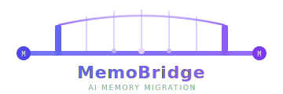

<p align="center">
  
</p>

<p align="center">
  <b>让你的 AI 记忆自由流动</b><br/>
  <sub>在 CodeBuddy、Claude Code、Cursor、Hermes、ChatGPT、豆包、Kimi 之间一键迁移记忆</sub>
</p>

<p align="center">
  <a href="https://github.com/gonelake/memo-bridge/actions/workflows/ci.yml">
    
  </a>
  <a href="https://www.npmjs.com/package/memo-bridge">
    
  </a>
  <a href="./LICENSE">
    
  </a>
  = 22"/>
  <a href="https://github.com/gonelake/memo-bridge/stargazers">
    
  </a>
  <a href="https://github.com/gonelake/memo-bridge/network/members">
    
  </a>
</p>

<p align="center">
  <a href="#-为什么需要-memobridge">为什么</a> •
  <a href="#-快速开始">快速开始</a> •
  <a href="#-支持工具">支持工具</a> •
  <a href="#-命令参考">命令参考</a> •
  <a href="#-v02-新特性">v0.2 新特性</a> •
  <a href="#-路线图">路线图</a> •
  <a href="./README_EN.md">English</a>
</p>

---

## 🎬 演示

> **一键迁移：CodeBuddy → Claude Code**

```
$ npx memo-bridge migrate --from codebuddy --to claude-code

🌉 MemoBridge v0.2.0

  ✔ 检测到 CodeBuddy（3 个工作区）
  ✔ 提取记忆 65 条
  ✔ 隐私脱敏（已屏蔽 2 项敏感信息）
  ✔ 质量评分完成（平均 0.74）
  ✔ 自动备份 ~/.claude/CLAUDE.md → .memobridge/backups/claude-code-20260423/
  ✔ 写入 ~/.claude/CLAUDE.md（2,341 字符）

  🎉 迁移完成！如需回滚：
     npx memo-bridge backup restore claude-code-20260423
```

<!-- 🎬 Asciinema 录屏上线后替换为实际 GIF：
  录制命令：asciinema rec demo.cast --overwrite
  转换命令：agg demo.cast docs/demo.gif
  然后取消下行注释：
-->
<!--  -->

---

## ❓ 为什么需要 MemoBridge？

你在不同的 AI 工具里积累了大量上下文——编码习惯、项目背景、个人偏好……但这些记忆**被锁在每个工具的孤岛里**：

| 痛点 | 现状 |
|------|------|
| 🔒 豆包 / Kimi 的记忆无法导出 | 换工具 = 从零开始 |
| 🔄 Cursor 和 CodeBuddy 互相隔离 | 同一个项目、两套上下文 |
| 💻 换电脑 / 重装 | AI 对你一无所知 |
| 🤖 Hermes 无法继承 OpenClaw 的记忆 | 每次都要重新调教 |

**MemoBridge 一行命令解决这一切：**

```bash
npx memo-bridge migrate --from codebuddy --to claude-code
```

---

## ✨ 核心特性

| 特性 | 说明 |
|------|------|
| 🔍 **自动检测** | 扫描系统，发现所有已安装的 AI 工具 |
| 📤 **一键导出** | 提取记忆并输出为标准 Markdown + YAML 格式 |
| 📥 **智能导入** | 自动适配目标格式（含 Hermes 2200 字符限制） |
| 📋 **提示词模板** | 为不支持直接导出的云端工具提供最优引导 prompt |
| 🔐 **隐私脱敏** | 18+ 种模式自动识别并遮蔽 API Key / 密码 / Token |
| 📁 **多工作区** | 自动扫描所有工作区，合并去重 |
| 🔄 **增量同步** | 只导入新增/变更内容，反复运行不重复 |
| 💾 **自动备份** | 导入前快照，一键回滚 |
| 🇨🇳 **国内工具** | 首个覆盖豆包、Kimi 的迁移工具 |

---

## 🚀 快速开始

```bash
# 无需安装，直接使用
npx memo-bridge

# 或全局安装
npm install -g memo-bridge
```

**环境要求**：Node.js >= 22.0.0

### 第一步：检测工具

```bash
npx memo-bridge detect
```

```
🌉 MemoBridge — Tool Detection

  📂 本地工具（可直接读写）:
     ✅ CodeBuddy    ~/.codebuddy/  (3 个工作区)
     ✅ Claude Code  ~/.claude/CLAUDE.md
     ✅ Cursor       .cursorrules

  ☁️  云端工具（Prompt 引导）:
     📋 ChatGPT
     📋 豆包 (Doubao)
     📋 Kimi
```

### 第二步：导出记忆

```bash
# 从 CodeBuddy 导出（自动扫描所有工作区）
npx memo-bridge extract --from codebuddy

# 仅指定一个工作区
npx memo-bridge extract --from codebuddy --workspace ~/projects/my-app

# 增量导出（只导出上次之后新增/变更的内容）
npx memo-bridge extract --from codebuddy --since ./previous-export.md
```

### 第三步：导入记忆

```bash
# 导入到 Claude Code（写入 CLAUDE.md）
npx memo-bridge import --to claude-code --input ./memo-bridge.md

# 导入到 Hermes（自动裁剪到 2200 字符）
npx memo-bridge import --to hermes --input ./memo-bridge.md

# 增量导入（已导入的内容不重复写入）
npx memo-bridge import --to cursor --input ./memo-bridge.md --mode=incremental

# 预览模式（不实际写入）
npx memo-bridge import --to hermes --input ./memo-bridge.md --dry-run
```

### 一键迁移

```bash
npx memo-bridge migrate --from codebuddy --to claude-code
npx memo-bridge migrate --from openclaw --to hermes
npx memo-bridge migrate --from codebuddy --to cursor --workspace ~/projects/my-app
```

### 云端工具（豆包 / Kimi / ChatGPT）

```bash
# Step 1：获取最优导出提示词
npx memo-bridge prompt --for doubao

# Step 2：将提示词粘贴到豆包对话，复制 AI 回答保存为 .md 文件

# Step 3：导入到目标工具
npx memo-bridge import --to claude-code --input ./doubao-export.md
```

### 备份与回滚

```bash
npx memo-bridge backup list                     # 查看所有备份
npx memo-bridge backup list --tool claude-code  # 按工具筛选
npx memo-bridge backup restore <id>             # 一键恢复
```

---

## 🛠 支持工具

### 本地工具（全自动，直接读写文件）

| 工具 | 导出 | 导入 | 记忆路径 | 多工作区 |
|------|:----:|:----:|----------|:--------:|
| **CodeBuddy** | ✅ 自动 | ✅ 自动 | `.codebuddy/automations/*/memory.md` + `.memory/*.md` | ✅ |
| **OpenClaw** | ✅ 自动 | ✅ 自动 | `~/.openclaw/workspace/MEMORY.md` + `memory/` | ✅ |
| **Hermes Agent** | ✅ 自动 | ✅ 自动 | `~/.hermes/memories/MEMORY.md` + `USER.md` | — |
| **Claude Code** | ✅ 自动 | ✅ 自动 | `CLAUDE.md` + `~/.claude/CLAUDE.md` | — |
| **Cursor** | ✅ 自动 | ✅ 自动 | `.cursorrules` + `.cursor/rules/*.md` | ✅ |

### 云端工具（Prompt 引导，需手动复制粘贴）

| 工具 | 导出 | 导入 | 备注 |
|------|:----:|:----:|------|
| **ChatGPT** | 📋 Prompt 引导 | 📋 生成"请记住"指令 | 无 API 直读支持 |
| **豆包 (Doubao)** | 📋 Prompt 引导 | 📋 生成"请记住"指令 | 国内工具，首发支持 |
| **Kimi** | 📋 Prompt 引导 | 📋 上下文注入文本 | 国内工具，首发支持 |

> **图例：** ✅ 全自动 · 📋 Prompt 引导（需人工操作一次）

---

## 📖 命令参考

### `detect` — 检测工具

```bash
memo-bridge detect
```

### `extract` — 导出记忆

```bash
memo-bridge extract --from <tool> [options]

  -f, --from <tool>         来源工具（必填）
  -w, --workspace <path>    指定单个工作区
  -s, --scan-dir <path>     指定扫描根目录（默认 ~/projects）
  -o, --output <path>       输出文件（默认 ./memo-bridge.md）
      --since <prev.md>     增量导出：只输出相对上次新增/变更的记忆
  -v, --verbose             详细输出
```

### `import` — 导入记忆

```bash
memo-bridge import --to <tool> --input <file> [options]

  -t, --to <tool>           目标工具（必填）
  -i, --input <file>        输入文件
  -w, --workspace <path>    目标工作区
      --mode=incremental    增量模式（已导入内容不重复写入）
      --dry-run             预览模式，不实际写入
```

### `migrate` — 一键迁移

```bash
memo-bridge migrate --from <tool> --to <tool> [options]

  -f, --from <tool>         来源工具
  -t, --to <tool>           目标工具
  -w, --workspace <path>    工作区路径
```

### `prompt` — 获取导出提示词

```bash
memo-bridge prompt --for <tool>    # 支持：doubao | kimi | chatgpt
```

### `backup` — 备份管理

```bash
memo-bridge backup list [--tool <tool>]    # 列出备份
memo-bridge backup restore <id>            # 恢复指定备份
```

---

## 🆕 v0.2 新特性

> v0.1 实现了**"能搬"**，v0.2 实现了**"敢用"**。

### 📊 质量评分
每条记忆自动附带质量信号：
- `content_hash` — SHA-256 前 12 位，用于增量同步身份
- `importance` — 关键词权重 + 内容长度启发式
- `freshness` — 基于 `updated_at` 的分段时间衰减
- `quality` — `0.5·重要性 + 0.3·新鲜度 + 0.2·置信度` 加权合成

零新增依赖，纯规则启发式，不引入 embedding / LLM。

### 💾 自动备份 + 回滚
- 每次 `import` / `migrate` 前自动快照目标文件
- 快照路径：`.memobridge/backups/<tool>-<时间戳>/`
- 通过 `backup.retention` 配置保留条数（默认 10）

### 🔄 增量同步
- `--since <prev.md>`：只提取上次导出后新增/变更的记忆
- `--mode=incremental`：基于每工具 ledger，反复导入不重复
- Ledger 使用 O_APPEND 原子追加，并发安全

### ⚙️ 配置文件
```yaml
# .memobridge.yaml（项目级）或 ~/.config/memobridge/config.yaml（全局）
default_workspace: ~/projects/my-app
privacy:
  extra_patterns:
    - 'my-secret-\w+'
quality:
  importance_keywords:
    - '关键'
    - 'critical'
backup:
  retention: 10
```

优先级：CLI 参数 > 项目配置 > 全局配置 > 内置默认值。

---

## 🔒 隐私与安全

- 🔐 **本地处理** — 所有数据在本地处理，不上传任何内容
- 🛡️ **自动脱敏** — 18+ 种模式（OpenAI / Anthropic / GitHub / AWS Key、Bearer Token、DB 连接串、SSH Key、邮箱、私有 IP……）
- 📏 **路径安全** — 禁止访问 `/etc`、`~/.ssh` 等敏感目录，null-byte 拦截，符号链接守卫
- 📦 **零遥测** — 不收集任何使用数据

---

## 📄 中间格式

MemoBridge 使用 **Markdown + YAML front matter** 作为标准交换格式：

```markdown
---
version: "0.1"
exported_at: "2026-04-23T10:00:00+08:00"
source:
  tool: codebuddy
  extraction_method: file
stats:
  total_memories: 65
  categories: 4
---

# 用户画像
## 身份
- 姓名：Alice

## 沟通偏好
- 简洁直接，不需要过多解释

# 知识积累
...
```

- 📖 **人类可读** — 任意编辑器可打开审查
- 🤖 **LLM 友好** — 可直接用作 `CLAUDE.md` / `.cursorrules`
- 🔄 **Git 友好** — 纯文本，可版本管理
- 🔧 **可扩展** — YAML 元数据支持自定义字段

---

## 🗺 路线图

| 版本 | 主题 | 状态 |
|------|------|------|
| **v0.1** | MVP：8 个工具 + Prompt 模板 + 隐私脱敏 | ✅ 已发布 |
| **v0.2** | 质量评分 + 自动备份 + 增量同步 + 配置文件 | ✅ 已发布 |
| **v0.3** | MCP Server（跨工具实时记忆共享）+ 三路合并 | 🚧 规划中 |
| **v0.4** | Web UI + 浏览器扩展（ChatGPT / 豆包可视化导出） | 📌 待规划 |
| **v1.0** | 云端备份 + 团队共享 + 通义 / 智谱 / Windsurf 适配器 | 📌 待规划 |

---

## 🛠 开发

```bash
git clone https://github.com/gonelake/memo-bridge.git
cd memo-bridge
npm install
npm run dev       # 开发模式（watch）
npm run build     # 构建
npm run lint      # 类型检查
npm test          # 运行全部测试（539 个）
npm test -- privacy           # 运行单个测试文件（按名称过滤）
```

### 添加新工具适配器

1. `src/extractors/<tool>.ts`：继承 `BaseExtractor`，实现 `extract()`
2. `src/importers/<tool>.ts`：继承 `BaseImporter`，实现 `import()`
3. `src/registry/defaults.ts`：调用 `registerDefaults()` 注册
4. `src/core/types.ts`：在 `ToolId` 和 `TOOL_NAMES` 中添加新工具 ID

---

## 🤝 贡献

欢迎任何形式的贡献！

- 🔌 新工具适配器（Windsurf / Cline / Copilot / 通义 / 智谱）
- 🎬 Asciinema 演示录制
- 🌐 国际化
- 🧪 测试用例
- 📖 文档改进

---

## 许可证

[MIT](./LICENSE)

---

<p align="center">
  <b>MemoBridge</b> — 你的 AI 记忆，不该被任何工具绑架。<br/>
  <sub><a href="./README_EN.md">English README →</a></sub>
</p>
